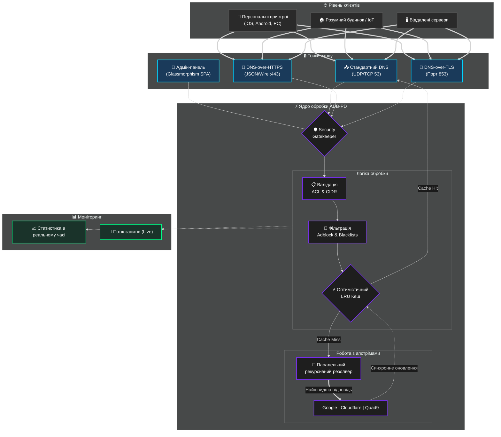

# 🛡️ ADB-PD (Приватний DNS Adblock)

<p align="center">
  <a href="README_ENG.md">
    
  </a>
  <a href="README.md">
    
  </a>
</p>

<br>

**Високопродуктивний DNS-over-HTTPS/TLS/QUIC резолвер з професійною адмін-панеллю у стилі Glassmorphism.**

[](https://hub.docker.com/r/webyhomelab/adb-pd)
[](https://hub.docker.com/r/webyhomelab/adb-pd)
[](https://opensource.org/licenses/MIT)

---

## 🌍 Огляд

**ADB-PD** — це легке, приватне DNS-рішення, створене для максимальної швидкості та повного контролю. Це сучасна альтернатива застарілим DNS-серверам, яка фокусується на зашифрованих протоколах (DoH, DoT) та надає зручний інтерфейс у стилі Glassmorphism для моніторингу мережі в реальному часі.

---

## 🏗 Архітектура системи (v0.1.0-2026)



---

## ✨ Ключові можливості

### 🚀 Продуктивність та логіка
- **Паралельне опитування апстрімів:** Опитує декілька DNS-провайдерів одночасно (Google, Cloudflare, Quad9) та повертає найшвидшу відповідь.
- **Оптимістичне кешування:** Віддає записи з кешу, термін дії яких закінчився, одночасно оновлюючи їх у фоновому режимі.
- **Умовна маршрутизація:** Спеціальні правила для перенаправлення конкретних доменів на певні DNS-сервери.

### 🔒 Безпека та приватність
- **Зашифровані протоколи:** Нативна підтримка **DNS-over-HTTPS (DoH)** та **DNS-over-TLS (DoT)**.
- **Режим Stealth:** Неавторизовані запити просто ігноруються, що робить сервер невидимим для сканерів портів.
- **Гнучкий ACL:** Просунуті списки контролю доступу на основі IP-діапазонів або Client ID.

### 🎨 Адмін-панель
- **Glassmorphism UI:** Сучасна SPA-панель з ефектами розмиття та адаптивним дизайном.
- **Live-логи:** Потік DNS-запитів у реальному часі з детальною інформацією про час обробки.
- **Візуальна аналітика:** Інтерактивні графіки обсягу запитів та ефективності фільтрації.

---

## 🛠 Стек технологій
- **Backend:** Python 3.12 (FastAPI, Hypercorn, DNslib)
- **Frontend:** Vanilla JS / Tailwind-inspired CSS / Chart.js
- **Container:** Docker (на базі Alpine)

---

## 🚀 Розгортання

### Docker (Рекомендовано)
```bash
docker run -d --name adb-pd \
  --network host \
  -v $(pwd)/config.yaml:/app/config.yaml \
  -v /etc/letsencrypt:/etc/letsencrypt:ro \
  --restart always \
  webyhomelab/adb-pd:latest
```

---

## 🤝 Співпраця
Розроблено з ❤️ командою **Weby Homelab**. Будемо раді вашим Fork та Pull Request!

---

## 📜 Ліцензія
MIT License. Вільно для особистого та комерційного використання.

<p align="center">
  Made with ❤️ in Kyiv under air raid sirens and blackouts<br>
  <strong>© 2026 Weby Homelab</strong>
</p>
