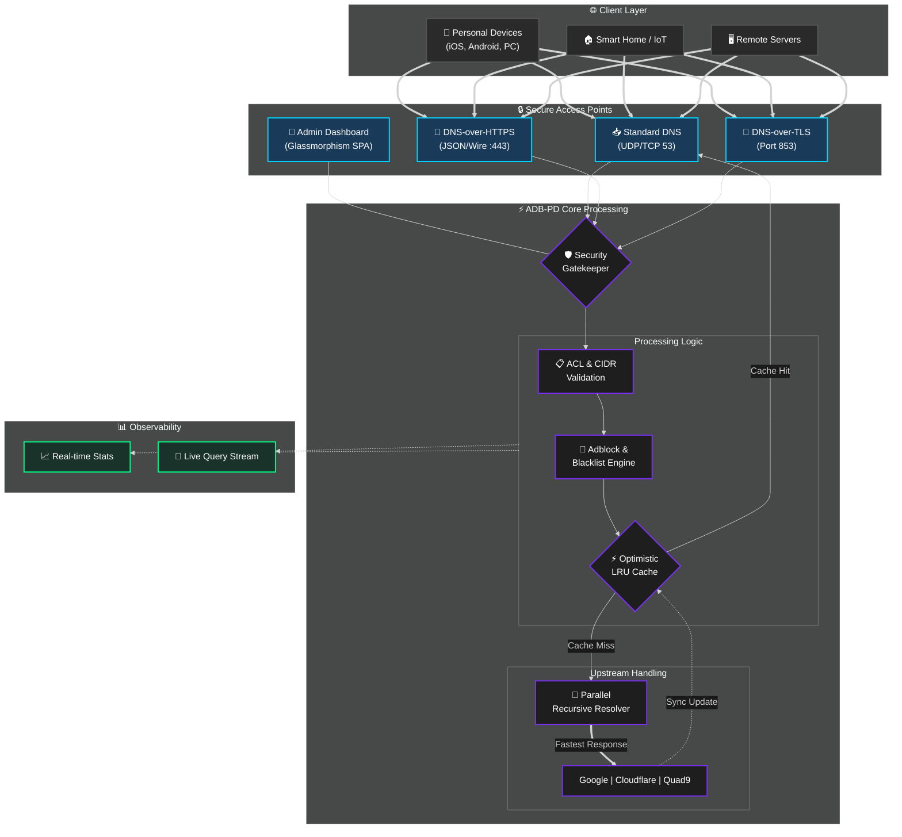

# 🛡️ ADB-PD (Private DNS Adblock)

<p align="center">
  <a href="README_ENG.md">
    
  </a>
  <a href="README.md">
    
  </a>
</p>

<br>

**High-performance DNS-over-HTTPS/TLS/QUIC resolver with a pro-grade Glassmorphism Dashboard.**

[](https://hub.docker.com/r/webyhomelab/adb-pd)
[](https://hub.docker.com/r/webyhomelab/adb-pd)
[](https://opensource.org/licenses/MIT)

---

## 🌍 Overview

**ADB-PD** is a lightweight, self-hosted DNS solution designed for privacy, speed, and absolute control. It serves as a modern alternative to legacy DNS servers, focusing on encrypted protocols (DoH, DoT) and providing a real-time, aesthetically pleasing management experience.

---

## 🏗 System Architecture (v0.1.0-2026)



---

## ✨ Key Features

### 🚀 Performance & Logic
- **Parallel Upstream Resolution:** Queries multiple DNS providers simultaneously (Google, Cloudflare, Quad9) and returns the fastest response.
- **Optimistic Caching:** Serves expired records from cache while updating them in the background.
- **Conditional Routing:** Custom rules to route specific domains to specific upstream servers.

### 🔒 Security & Privacy
- **Encrypted Protocols:** Native support for **DNS-over-HTTPS (DoH)** and **DNS-over-TLS (DoT)**.
- **Stealth Mode:** Unauthorized queries are silently dropped.
- **Robust ACL:** Advanced Access Control Lists based on IP ranges or unique Client IDs.

### 🎨 Pro-Dashboard
- **Glassmorphism UI:** Modern, responsive SPA dashboard with blur effects.
- **Live Query Logs:** Real-time stream of DNS requests with detailed timing.
- **Visual Analytics:** Interactive charts for performance metrics.

---

## 🛠 Tech Stack
- **Backend:** Python 3.12 (FastAPI, Hypercorn, DNslib)
- **Frontend:** Vanilla JS / Tailwind-inspired CSS / Chart.js
- **Container:** Docker (Alpine-based)

---

## 🚀 Deployment

### Docker (Recommended)
```bash
docker run -d --name adb-pd \
  --network host \
  -v $(pwd)/config.yaml:/app/config.yaml \
  -v /etc/letsencrypt:/etc/letsencrypt:ro \
  --restart always \
  webyhomelab/adb-pd:latest
```

---

## 🤝 Contribution
Developed with ❤️ by **Weby Homelab**. Feel free to fork and submit Pull Requests!

---

## 📜 License
MIT License. Free for personal and commercial use.

<p align="center">
  Made with ❤️ in Kyiv under air raid sirens and blackouts<br>
  <strong>© 2026 Weby Homelab</strong>
</p>
